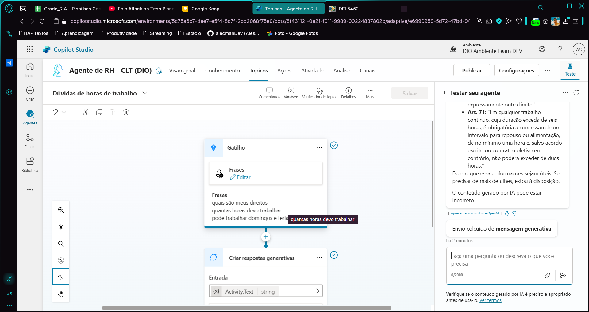

# 🤖 Agente Copilot - Direito Trabalhista (Brasil)

Este é um agente Copilot desenvolvido com o Microsoft Copilot Studio com o objetivo de auxiliar usuários com dúvidas relacionadas ao **Direito Trabalhista no Brasil**. Abaixo, detalhamos sua configuração, propósito, principais recursos e melhores práticas utilizadas.

---

## 🎯 Propósito

O agente atua como um **assistente jurídico digital** focado em:
- Esclarecer dúvidas sobre **leis trabalhistas brasileiras**.
- Fornecer orientações sobre **direitos e deveres de empregadores e empregados**.
- Ajudar na compreensão de temas como **férias, FGTS, aviso prévio, horas extras, contrato de trabalho**, entre outros.

---

## 🛠️ Métodos de Criação Testados

Durante a construção do Copilot, foram testadas as três abordagens disponíveis na plataforma:

1. **Modelo pré-existente (template):**
   - Análise de fluxos prontos para compreender padrões.

2. **Criação com texto (IA generativa):**
   - Inserção de um prompt descrevendo o agente para gerar uma base inicial.

3. **Criação personalizada (do zero):**
   - Escolhida como abordagem final para total controle do fluxo e linguagem.

---

## 📌 Tópicos Principais Criados

- Introdução ao Direito Trabalhista
- Jornada de trabalho e banco de horas
- Férias e 13º salário
- Contratos de trabalho
- Demissão e aviso prévio
- FGTS e INSS
- Estabilidade e licenças (maternidade, paternidade)
- Assédio moral e segurança no trabalho

Cada tópico conta com:
- **Gatilhos personalizados** para facilitar o acionamento.
- **Mensagens claras e objetivas** com linguagem acessível.
- **Ramificações** para adaptar a resposta de acordo com a necessidade do usuário.

---

## 🧠 Uso de Entidades e Variáveis

- **Entidades criadas:** "benefício", "tipo_demissao", "pergunta_frequente"
- **Variáveis utilizadas:**
  - `nomeUsuario` – Para personalizar a conversa.
  - `temaTrabalhista` – Guarda o assunto de interesse.
  - `resultadoBusca` – Resultado de respostas contextuais.

---

## 🔍 Fontes e Validações

As informações fornecidas pelo Copilot foram embasadas nas seguintes fontes:
- Consolidação das Leis do Trabalho (CLT)
- Portal Gov.br
- Documentos oficiais do Ministério do Trabalho e Emprego

---

## ✅ Boas Práticas Aplicadas

- **Tópicos curtos e objetivos**
- **Uso de linguagem neutra e clara**
- **Ramificações para múltiplos caminhos**
- **Mensagens de fallback para dúvidas fora do escopo**
- **Experiência empática e humanizada**

---

## 📦 Possibilidades Futuras

- Integração com Power Automate para abertura de chamados
- Enriquecimento com conectores externos para busca em tempo real
- Acesso a bases jurídicas atualizadas automaticamente

---

> Desenvolvido como parte do desafio prático no Microsoft Copilot Studio.
> O objetivo é fornecer acesso democrático e facilitado ao conhecimento jurídico trabalhista.