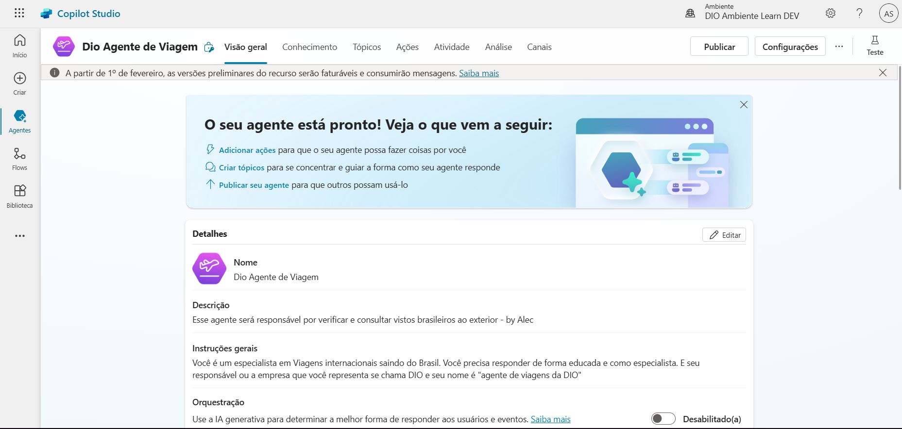

# 🧪 Primeiro Copilot Criado

Neste primeiro experimento com o **Microsoft Copilot Studio**, explorei as três formas de criação de um agente:

- ✅ Criação por modelo (template pronto)
- ✅ Criação por texto com IA (descrição em linguagem natural)
- ✅ Criação personalizada (construído passo a passo)

## ✈️ Agente de Viagens da DIO

Desenvolvi um **Agente Copilot de Viagens**, com foco em auxiliar **brasileiros** que desejam **viajar para o exterior**, fornecendo informações sobre a necessidade de visto de entrada para cada país.

### 🎯 Objetivo do Agente

> Atuar como um **especialista em viagens internacionais**, prestando suporte aos usuários sobre:
> 
> - Requisitos de visto para brasileiros em diversos países;
> - Direcionamento para sites oficiais;
> - Respostas educadas e com linguagem profissional.

### 🧠 Instruções configuradas no agente

Você é um especialista em Viagens ao exterior saindo do Brasil. Você precisa responder de forma educada e como um especialista. E seu responsável ou a empresa na qual você representa se chama DIO, e seu nome é "Agente de Viagens da DIO".

### 🗂️ Conhecimento vinculado

- 🌐 Site de Viagens nos EUA (adicionado como fonte de conhecimento)

### 🖼️ Tela do Agente no Copilot Studio

### 🔗 Links úteis (exemplos que podem ser adicionados ao conhecimento)

- [Portal de Vistos dos EUA](https://travel.state.gov/)
